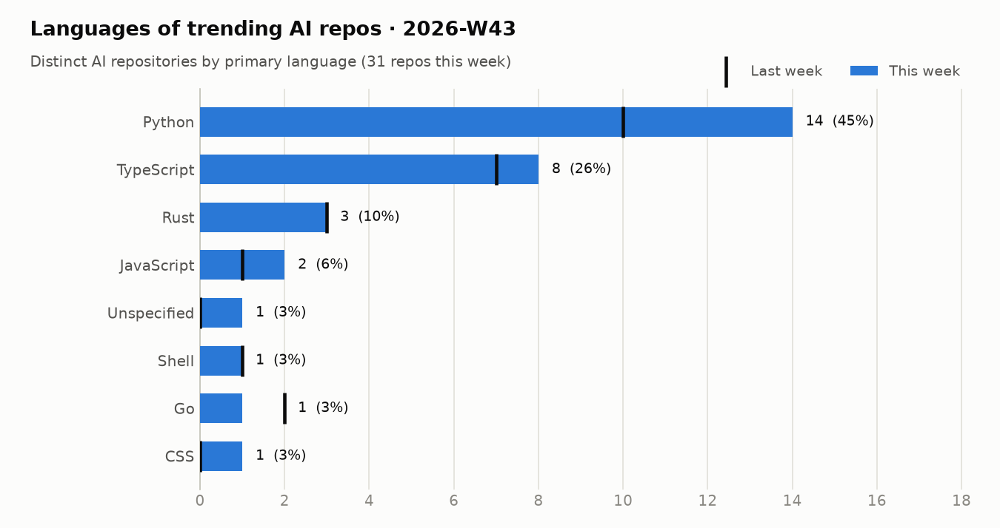
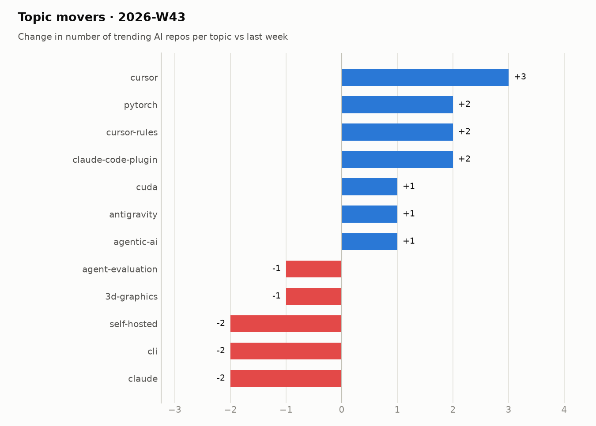

# Trending AI Repos Tracker

A daily record of which AI repositories are trending on GitHub, with a weekly analysis of **which topics are rising** and **which languages dominate**.

Every morning a GitHub Actions workflow reads the GitHub trending page, looks up each repository's topics, flags the AI-related ones, and appends the day to a CSV. Every Monday the previous week is analyzed and saved as a report with charts. The section below refreshes daily with today's list and the week so far.

## Live view

<!-- TRACKER_START -->
### 🔥 AI repos trending today · 2026-10-19

10 of 13 trending repositories are AI-related.

| # | Repo | Language | ⭐ today | ⭐ total | Topics |
|--:|---|---|--:|--:|---|
| 1 | [MadsLorentzen/ai-job-search](https://github.com/MadsLorentzen/ai-job-search)<br><sub>Sponsor Star MadsLorentzen / ai-job-search The job search that runs on your machine. AI jo…</sub> | Python | 2,232 | 54,462 | `ai` `ai-agents` `career` `claude-code` |
| 2 | [anthropics/claude-plugins-official](https://github.com/anthropics/claude-plugins-official)<br><sub>Star anthropics / claude-plugins-official Official, Anthropic-managed directory of high qu…</sub> | Python | 1,175 | 42,921 | `claude-code` `mcp` `skills` |
| 3 | [anomalyco/opencode](https://github.com/anomalyco/opencode)<br><sub>Sponsor Star anomalyco / opencode The open source coding agent.</sub> | TypeScript | 1,414 | 216,948 | – |
| 5 | [ruvnet/ruflo](https://github.com/ruvnet/ruflo)<br><sub>Star ruvnet / ruflo 🌊 The original agent harness. Deploy intelligent multi-player swarms, …</sub> | TypeScript | 513 | 76,735 | `agentic-ai` `agentic-framework` `agentic-workflow` `agents` |
| 6 | [akitaonrails/ai-memory](https://github.com/akitaonrails/ai-memory)<br><sub>Star akitaonrails / ai-memory Solution for long term memory for agent coding CLIs and to f…</sub> | Rust | 512 | 10,736 | – |
| 7 | [stablyai/orca](https://github.com/stablyai/orca)<br><sub>Star stablyai / orca Orca is the place for working with a fleet of agents (e.g. Grok Bot, …</sub> | TypeScript | 1,146 | 97,193 | `ade` `agent-ide` `ai-agents` `automation` |
| 8 | [HKUDS/CLI-Anything](https://github.com/HKUDS/CLI-Anything)<br><sub>Star HKUDS / CLI-Anything "CLI-Anything: Making ALL Software Agent-Native" -- CLI-Hub: htt…</sub> | Python | 589 | 54,821 | – |
| 9 | [debpalash/VoiceStudio](https://github.com/debpalash/VoiceStudio)<br><sub>Sponsor Star debpalash / VoiceStudio VoiceStudio is the open-source, fully-local ElevenLab…</sub> | Python | 2,082 | 76,204 | `ai` `audiobook` `cuda` `dubbing` |
| 11 | [mlabonne/llm-course](https://github.com/mlabonne/llm-course)<br><sub>Star mlabonne / llm-course Course to get into Large Language Models (LLMs) with roadmaps a…</sub> | – | 81 | 84,237 | `course` `large-language-models` `llm` `machine-learning` |
| 13 | [Comfy-Org/ComfyUI](https://github.com/Comfy-Org/ComfyUI)<br><sub>Star Comfy-Org / ComfyUI The most powerful and modular diffusion model GUI, api and backen…</sub> | Python | 154 | 138,949 | `ai` `comfy` `comfyui` `python` |

### 📊 This week so far · 2026-W43

#### Summary

- **10** distinct AI repos trended over 1 day(s) (last week: 27)
- AI share of all trending slots: **77%** (-1 pts vs last week)
- Dominant language: **Python** (50% of AI repos)

#### Languages

<picture><source media="(prefers-color-scheme: dark)" srcset="charts/2026-W43-languages-dark.png"></picture>

| Language | Repos | Share | Last week |
|---|--:|--:|--:|
| Python | 5 | 50% | 10 |
| TypeScript | 3 | 30% | 7 |
| Rust | 1 | 10% | 3 |
| Unspecified | 1 | 10% | 0 |

#### Topics

<picture><source media="(prefers-color-scheme: dark)" srcset="charts/2026-W43-topics-dark.png"></picture>

| Topic | Repos this week |
|---|--:|
| `claude-code` | 3 |
| `ai-agents` | 3 |
| `skills` | 2 |
| `codex` | 2 |
| `job-application` | 1 |
| `job-search` | 1 |
| `interview-preparation` | 1 |
| `job-hunting` | 1 |
| `latex` | 1 |
| `career` | 1 |
| `cover-letter` | 1 |
| `cv` | 1 |

#### Most persistent AI repos

| Repo | Language | Days trending | Stars gained | Total stars |
|---|---|--:|--:|--:|
| [MadsLorentzen/ai-job-search](https://github.com/MadsLorentzen/ai-job-search) | Python | 1 | 2,232 | 54,462 |
| [debpalash/VoiceStudio](https://github.com/debpalash/VoiceStudio) | Python | 1 | 2,082 | 76,204 |
| [anomalyco/opencode](https://github.com/anomalyco/opencode) | TypeScript | 1 | 1,414 | 216,948 |
| [anthropics/claude-plugins-official](https://github.com/anthropics/claude-plugins-official) | Python | 1 | 1,175 | 42,921 |
| [stablyai/orca](https://github.com/stablyai/orca) | TypeScript | 1 | 1,146 | 97,193 |
| [HKUDS/CLI-Anything](https://github.com/HKUDS/CLI-Anything) | Python | 1 | 589 | 54,821 |
| [ruvnet/ruflo](https://github.com/ruvnet/ruflo) | TypeScript | 1 | 513 | 76,735 |
| [akitaonrails/ai-memory](https://github.com/akitaonrails/ai-memory) | Rust | 1 | 512 | 10,736 |
| [Comfy-Org/ComfyUI](https://github.com/Comfy-Org/ComfyUI) | Python | 1 | 154 | 138,949 |
| [mlabonne/llm-course](https://github.com/mlabonne/llm-course) | – | 1 | 81 | 84,237 |

➡️ Last full weekly analysis: [2026-W42](reports/weekly/2026-W42.md) · [all reports](reports/weekly)

_Tracking since 2026-10-01 · 19 day(s) of data · [raw data](data/trending.csv)_
<!-- TRACKER_END -->

## How it works

```
github.com/trending ──► GitHub API (topics, license, created) ──► AI classifier ──► data/trending.csv
                                                                                        │
                                              reports/weekly/YYYY-Www.md + charts ◄─────┘
```

1. **Collect.** Reads the daily [GitHub trending](https://github.com/trending) list (all languages) and records rank, stars, stars gained today, and language for every repository.
2. **Enrich.** Fetches each repository's topics, creation date and license from the GitHub REST API.
3. **Classify.** A repo counts as AI if it carries an AI topic (`llm`, `ai-agents`, `rag`, `mcp`, `computer-vision`, ...) or its name and description match AI keywords. All trending repos are stored, so the AI share of trending can be measured too.
4. **Analyze weekly.** For each finished ISO week (Monday–Sunday):
   - **Languages**: distinct AI repos per primary language, with last week for comparison
   - **Topics**: repos per topic, plus *movers* (biggest gains and drops vs last week) and topics that are new this week. Generic tags like `ai` or `python` are left out, so the movement shows what people are actually building.
   - **Most persistent repos**: AI repos that stayed on the trending list the most days, with stars gained
5. **Fallback.** If GitHub changes the trending page and it can no longer be parsed, the run falls back to the official Search API (new repos with AI topics gaining stars fast) and marks those rows as `search-fallback`, so a day is never empty.

## Data

`data/trending.csv`, one row per repository per day:

| Column | Meaning |
|--------|---------|
| `date`, `rank` | Day (WIB) and position on the trending list |
| `repo` | `owner/name` |
| `description`, `language`, `topics`, `license`, `created_at` | Repository metadata |
| `stars`, `forks`, `stars_today` | Totals and stars gained that day |
| `is_ai` | `1` if classified as AI-related |
| `source` | `trending` or `search-fallback` |

```python
import pandas as pd
df = pd.read_csv("https://raw.githubusercontent.com/arielshakaramiro/trending-ai-repos/main/data/trending.csv")
ai = df[df.is_ai == 1]
ai.groupby("language").repo.nunique().sort_values(ascending=False).head(10)
```

## Setup

1. Push this repository to GitHub. No secrets are needed: the workflow uses the built-in `GITHUB_TOKEN` for API calls.
2. **Actions → Daily Trending Snapshot → Run workflow** for the first run.

The first full weekly report appears on the Monday after the first complete week of data. Until then, the live view above shows the week-to-date analysis.

## Run locally

```bash
pip install -r requirements.txt
export GITHUB_TOKEN=ghp_...   # optional, raises the API rate limit
python tracker.py
```

## Customize

`config.json`:

- `ai_topics` / `ai_keywords`: what counts as AI
- `generic_topics`: tags ignored in topic analysis
- `trending_pages`: `[""]` is the all-languages list. Adding e.g. `"python"` also reads that language's list, which finds more repos but skews the language analysis toward the languages you add.
- `since`: `daily`, `weekly` or `monthly`

## License

MIT. Repository data comes from GitHub; each listed project keeps its own license.
