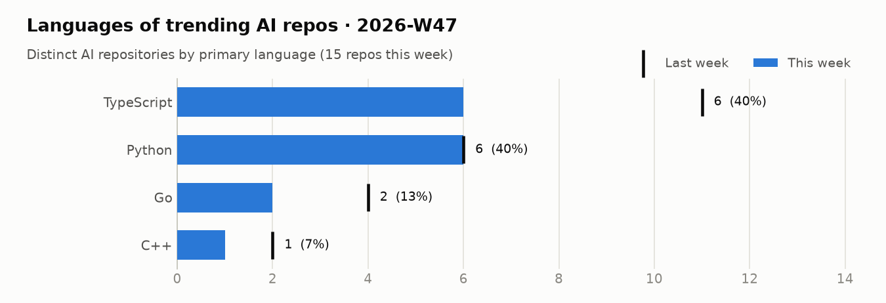
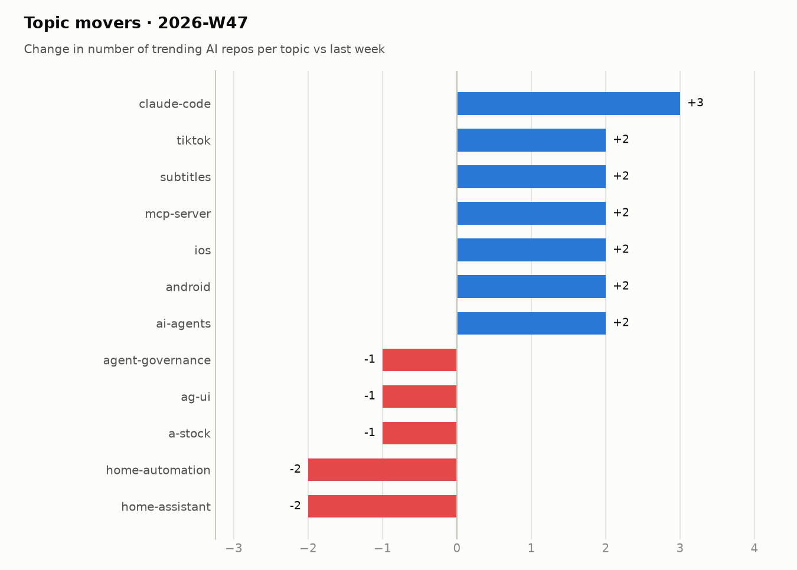

# Trending AI Repos Tracker

A daily record of which AI repositories are trending on GitHub, with a weekly analysis of **which topics are rising** and **which languages dominate**.

Every morning a GitHub Actions workflow reads the GitHub trending page, looks up each repository's topics, flags the AI-related ones, and appends the day to a CSV. Every Monday the previous week is analyzed and saved as a report with charts. The section below refreshes daily with today's list and the week so far.

## Live view

<!-- TRACKER_START -->
### 🔥 AI repos trending today · 2026-11-17

12 of 15 trending repositories are AI-related.

| # | Repo | Language | ⭐ today | ⭐ total | Topics |
|--:|---|---|--:|--:|---|
| 1 | [ag-ui-protocol/ag-ui](https://github.com/ag-ui-protocol/ag-ui)<br><sub>Star ag-ui-protocol / ag-ui AG-UI: the Agent-User Interaction Protocol. Bring Agents into …</sub> | TypeScript | 791 | 19,712 | `ag-ui-protocol` `agent-frontend` `agent-ui` `agentic-workflow` |
| 2 | [backnotprop/plannotator](https://github.com/backnotprop/plannotator)<br><sub>Star backnotprop / plannotator The workspace to stay in the loop and on top of agents - sh…</sub> | TypeScript | 696 | 12,858 | `agents` `claude-code` `code-review` `codex` |
| 3 | [dream-num/univer](https://github.com/dream-num/univer)<br><sub>Star dream-num / univer Build your own AI office with Univer Office SDK. Bring editing, ca…</sub> | TypeScript | 1,828 | 28,611 | `board` `collaboration` `doc` `docx` |
| 4 | [tradermonty/claude-trading-skills](https://github.com/tradermonty/claude-trading-skills)<br><sub>Star tradermonty / claude-trading-skills Claude Code skills for equity investors and trade…</sub> | Python | 837 | 6,688 | – |
| 5 | [elementalsouls/Claude-BugHunter](https://github.com/elementalsouls/Claude-BugHunter)<br><sub>Sponsor Star elementalsouls / Claude-BugHunter A Claude Code skill bundle for bug hunting …</sub> | Python | 1,094 | 7,927 | `ai-security` `anthropic` `application-security` `bug-bounty` |
| 8 | [google-labs-code/stitch-skills](https://github.com/google-labs-code/stitch-skills)<br><sub>Star google-labs-code / stitch-skills A library of Agent Skills designed to work with the …</sub> | TypeScript | 529 | 9,890 | – |
| 9 | [mvanhorn/last30days-skill](https://github.com/mvanhorn/last30days-skill)<br><sub>Star mvanhorn / last30days-skill AI agent skill that researches any topic across Reddit, X…</sub> | Python | 135 | 68,484 | `ai-prompts` `ai-skill` `bluesky` `claude` |
| 10 | [NVIDIA/SkillEvaluator](https://github.com/NVIDIA/SkillEvaluator)<br><sub>Star NVIDIA / SkillEvaluator Multi-tier framework for evaluating AI agent skills and plugi…</sub> | Python | 873 | 3,118 | `agent-evaluation` `agent-plugins` `agent-security` `agent-skills` |
| 11 | [alibaba/open-code-review](https://github.com/alibaba/open-code-review)<br><sub>Star alibaba / open-code-review Secure, fast, efficient, battle-tested at Alibaba's scale.…</sub> | Go | 951 | 53,308 | `agent` `agent-skills` `code-review` `code-review-assistant` |
| 12 | [google-research/paper-orchestra](https://github.com/google-research/paper-orchestra)<br><sub>Star google-research / paper-orchestra PaperOrchestra is a multi-agent framework for autom…</sub> | Python | 313 | 2,035 | `ai-research-assistant` `multi-agent-systems` |
| 13 | [ChromeDevTools/chrome-devtools-mcp](https://github.com/ChromeDevTools/chrome-devtools-mcp)<br><sub>Star ChromeDevTools / chrome-devtools-mcp Chrome DevTools for coding agents</sub> | TypeScript | 841 | 57,912 | `browser` `chrome` `chrome-devtools` `debugging` |
| 15 | [kajisho5/ffmpeg-skill](https://github.com/kajisho5/ffmpeg-skill)<br><sub>Sponsor Star kajisho5 / ffmpeg-skill Local video editor for coding agents: 42 FFmpeg tools…</sub> | Python | 367 | 7,435 | `agent-skills` `ai-agents` `audio-processing` `captions` |

### 📊 This week so far · 2026-W47

#### Summary

- **15** distinct AI repos trended over 2 day(s) (last week: 28)
- AI share of all trending slots: **89%** (+19 pts vs last week)
- No single dominant language: Python, TypeScript tied at 6 repo(s) each
- Rising topics: `mcp-server` (+1)

#### Languages

<picture><source media="(prefers-color-scheme: dark)" srcset="charts/2026-W47-languages-dark.png"></picture>

| Language | Repos | Share | Last week |
|---|--:|--:|--:|
| TypeScript | 6 | 40% | 11 |
| Python | 6 | 40% | 6 |
| Go | 2 | 13% | 4 |
| C++ | 1 | 7% | 2 |

#### Topics

<picture><source media="(prefers-color-scheme: dark)" srcset="charts/2026-W47-topics-dark.png"></picture>

| Topic | Repos this week |
|---|--:|
| `claude-code` | 6 |
| `codex` | 4 |
| `ai-agents` | 3 |
| `code-review` | 3 |
| `mcp` | 3 |
| `agent-skills` | 3 |
| `agentic-workflow` | 2 |
| `skills` | 2 |
| `mcp-server` | 2 |
| `cursor` | 2 |
| `claude` | 2 |
| `pptx` | 1 |

#### Most persistent AI repos

| Repo | Language | Days trending | Stars gained | Total stars |
|---|---|--:|--:|--:|
| [dream-num/univer](https://github.com/dream-num/univer) | TypeScript | 2 | 2,816 | 28,611 |
| [alibaba/open-code-review](https://github.com/alibaba/open-code-review) | Go | 2 | 1,642 | 53,308 |
| [backnotprop/plannotator](https://github.com/backnotprop/plannotator) | TypeScript | 2 | 1,562 | 12,858 |
| [ChromeDevTools/chrome-devtools-mcp](https://github.com/ChromeDevTools/chrome-devtools-mcp) | TypeScript | 2 | 1,558 | 57,912 |
| [tradermonty/claude-trading-skills](https://github.com/tradermonty/claude-trading-skills) | Python | 2 | 1,543 | 6,688 |
| [elementalsouls/Claude-BugHunter](https://github.com/elementalsouls/Claude-BugHunter) | Python | 2 | 1,192 | 7,927 |
| [ag-ui-protocol/ag-ui](https://github.com/ag-ui-protocol/ag-ui) | TypeScript | 2 | 1,146 | 19,712 |
| [NVIDIA/SkillEvaluator](https://github.com/NVIDIA/SkillEvaluator) | Python | 2 | 995 | 3,118 |
| [google-labs-code/stitch-skills](https://github.com/google-labs-code/stitch-skills) | TypeScript | 2 | 776 | 9,890 |
| [GoogleChrome/modern-web-guidance-src](https://github.com/GoogleChrome/modern-web-guidance-src) | TypeScript | 1 | 1,219 | 7,609 |

➡️ Last full weekly analysis: [2026-W46](reports/weekly/2026-W46.md) · [all reports](reports/weekly)

_Tracking since 2026-10-01 · 48 day(s) of data · [raw data](data/trending.csv)_
<!-- TRACKER_END -->

## How it works

```
github.com/trending ──► GitHub API (topics, license, created) ──► AI classifier ──► data/trending.csv
                                                                                        │
                                              reports/weekly/YYYY-Www.md + charts ◄─────┘
```

1. **Collect.** Reads the daily [GitHub trending](https://github.com/trending) list (all languages) and records rank, stars, stars gained today, and language for every repository.
2. **Enrich.** Fetches each repository's topics, creation date and license from the GitHub REST API.
3. **Classify.** A repo counts as AI if it carries an AI topic (`llm`, `ai-agents`, `rag`, `mcp`, `computer-vision`, ...) or its name and description match AI keywords. All trending repos are stored, so the AI share of trending can be measured too.
4. **Analyze weekly.** For each finished ISO week (Monday–Sunday):
   - **Languages**: distinct AI repos per primary language, with last week for comparison
   - **Topics**: repos per topic, plus *movers* (biggest gains and drops vs last week) and topics that are new this week. Generic tags like `ai` or `python` are left out, so the movement shows what people are actually building.
   - **Most persistent repos**: AI repos that stayed on the trending list the most days, with stars gained
5. **Fallback.** If GitHub changes the trending page and it can no longer be parsed, the run falls back to the official Search API (new repos with AI topics gaining stars fast) and marks those rows as `search-fallback`, so a day is never empty.

## Data

`data/trending.csv`, one row per repository per day:

| Column | Meaning |
|--------|---------|
| `date`, `rank` | Day (WIB) and position on the trending list |
| `repo` | `owner/name` |
| `description`, `language`, `topics`, `license`, `created_at` | Repository metadata |
| `stars`, `forks`, `stars_today` | Totals and stars gained that day |
| `is_ai` | `1` if classified as AI-related |
| `source` | `trending` or `search-fallback` |

```python
import pandas as pd
df = pd.read_csv("https://raw.githubusercontent.com/arielshakaramiro/trending-ai-repos/main/data/trending.csv")
ai = df[df.is_ai == 1]
ai.groupby("language").repo.nunique().sort_values(ascending=False).head(10)
```

## Setup

1. Push this repository to GitHub. No secrets are needed: the workflow uses the built-in `GITHUB_TOKEN` for API calls.
2. **Actions → Daily Trending Snapshot → Run workflow** for the first run.

The first full weekly report appears on the Monday after the first complete week of data. Until then, the live view above shows the week-to-date analysis.

## Run locally

```bash
pip install -r requirements.txt
export GITHUB_TOKEN=ghp_...   # optional, raises the API rate limit
python tracker.py
```

## Customize

`config.json`:

- `ai_topics` / `ai_keywords`: what counts as AI
- `generic_topics`: tags ignored in topic analysis
- `trending_pages`: `[""]` is the all-languages list. Adding e.g. `"python"` also reads that language's list, which finds more repos but skews the language analysis toward the languages you add.
- `since`: `daily`, `weekly` or `monthly`

## License

MIT. Repository data comes from GitHub; each listed project keeps its own license.
