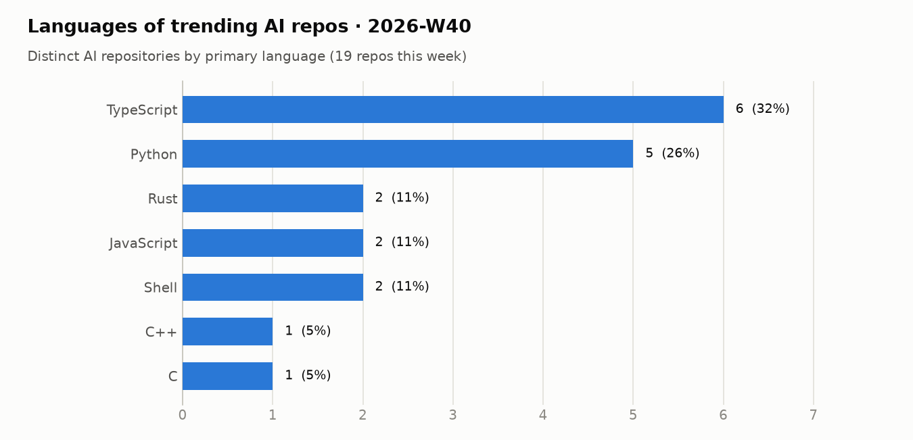
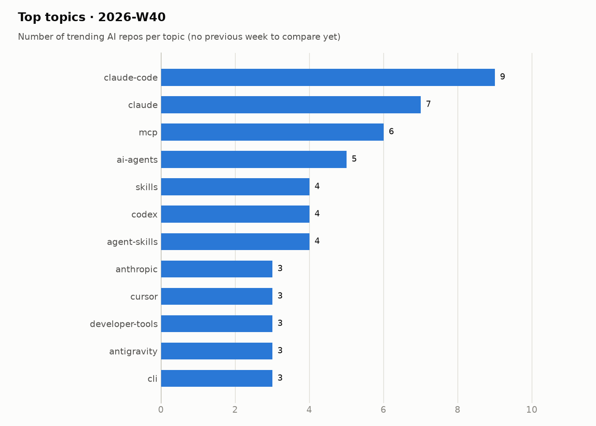

# Trending AI repos · 2026-W40

28 Sep 2026 – 04 Oct 2026

## Summary

- **29** distinct AI repos trended over 4 day(s)
- AI share of all trending slots: **78%**
- Dominant language: **TypeScript** (31% of AI repos)
- Rising topics: `claude-code` (+9), `claude` (+7), `mcp` (+6), `ai-agents` (+5), `agent-skills` (+4)
- New this week: `claude-code`, `claude`, `mcp`, `ai-agents`, `agent-skills`, `codex`

## Languages

<picture><source media="(prefers-color-scheme: dark)" srcset="../../charts/2026-W40-languages-dark.png"></picture>

| Language | Repos | Share | Last week |
|---|--:|--:|--:|
| TypeScript | 9 | 31% | – |
| Python | 8 | 28% | – |
| JavaScript | 5 | 17% | – |
| Rust | 2 | 7% | – |
| Shell | 2 | 7% | – |
| C++ | 1 | 3% | – |
| C | 1 | 3% | – |
| Go | 1 | 3% | – |

## Topics

<picture><source media="(prefers-color-scheme: dark)" srcset="../../charts/2026-W40-topics-dark.png"></picture>

| Topic | Repos this week |
|---|--:|
| `claude-code` | 9 |
| `claude` | 7 |
| `mcp` | 6 |
| `ai-agents` | 5 |
| `agent-skills` | 4 |
| `codex` | 4 |
| `skills` | 4 |
| `cli` | 3 |
| `antigravity` | 3 |
| `developer-tools` | 3 |
| `cursor` | 3 |
| `anthropic` | 3 |

## Most persistent AI repos

| Repo | Language | Days trending | Stars gained | Total stars |
|---|---|--:|--:|--:|
| [DietrichGebert/ponytail](https://github.com/DietrichGebert/ponytail) | JavaScript | 4 | 4,653 | 153,458 |
| [mattpocock/skills](https://github.com/mattpocock/skills) | Shell | 4 | 3,465 | 275,384 |
| [mksglu/context-mode](https://github.com/mksglu/context-mode) | TypeScript | 4 | 990 | 25,255 |
| [NVIDIA/OpenShell](https://github.com/NVIDIA/OpenShell) | Rust | 3 | 4,331 | 14,538 |
| [mvschwarz/openrig](https://github.com/mvschwarz/openrig) | TypeScript | 3 | 1,949 | 4,479 |
| [pbakaus/impeccable](https://github.com/pbakaus/impeccable) | JavaScript | 3 | 1,916 | 75,339 |
| [obra/superpowers](https://github.com/obra/superpowers) | Shell | 3 | 1,588 | 294,924 |
| [heygen-com/hyperframes](https://github.com/heygen-com/hyperframes) | TypeScript | 3 | 1,556 | 56,022 |
| [Panniantong/Agent-Reach](https://github.com/Panniantong/Agent-Reach) | Python | 2 | 2,392 | 89,842 |
| [JuliusBrussee/caveman](https://github.com/JuliusBrussee/caveman) | Go | 2 | 716 | 109,544 |
